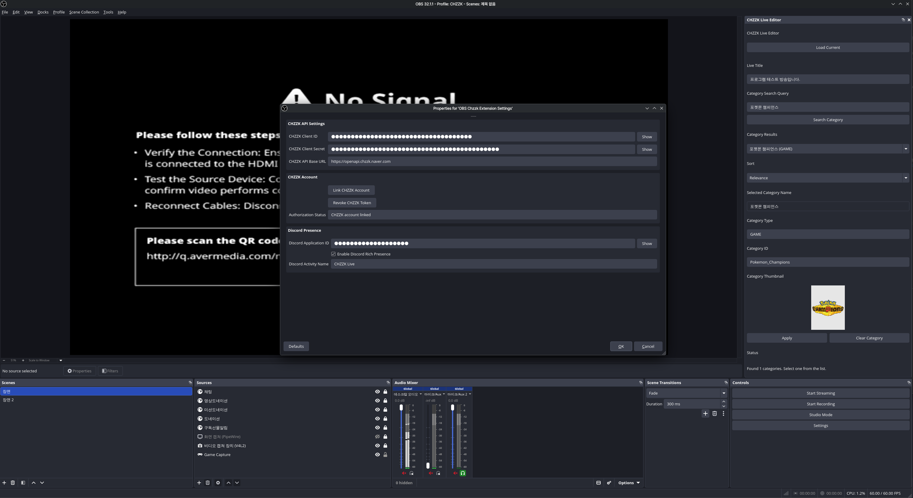

# OBS Chzzk Extension
[NAVER Chzzk](https://chzzk.naver.com) OBS Studio Extension

[한국어](README.ko.md) | [日本語](README.ja.md)

## Preview


## Pre-requirements
- (Recommended / Tested) OBS Studio - 32.1.1 or higher
- (Recommended / Tested) Rust Compiler - 1.94.1
- (Recommended) Linux - Debian 13 / Ubuntu 24.04 LTS / Fedora 43 / etc... more recent distribution

## Installation
```bash
# Clone the repository
git clone https://github.com/zeroday0619/obs-chzzk-extension.git
cd obs-chzzk-extension

# Build the OBS Chzzk Extension
make release

# Install the OBS Chzzk Extension
sudo cp target/release/libobs_chzzk_extension.so /usr/lib/x86_64-linux-gnu/obs-plugins/
```

## Usage
1. Open OBS Studio.
2. Go to `Tools` > `OBS Chzzk Extension Settings`.
    - How to Generate a Chzzk Client ID and Secret
        1. [Chzzk Developers](https://developers.chzzk.naver.com) > `내 서비스` > `애플리케이션 등록`
        2. Set `애플리케이션 ID` and `애플리케이션 이름`
        3. Set `Redirect URI` to `http://127.0.0.1:20132/callback`
        4. Set `API Scope` to `채널 정보 조회`, `채널 관리자 조회`, `채팅 메시지 조회`, `채팅 메시지 쓰기`, `채팅 공지 쓰기`, `채팅 설정 조회`, `채팅 설정 변경`, `후원 조회`, `방송 설정 조회`, `방송 설정 변경`, `활동제한 조회`, `활동제한 쓰기`, `구독 조회`, `유저 조회`
        5. Click `등록` to create the application and obtain the `Client ID` and `Client Secret`.
    - How to Generate a Discord Application ID
        1. [Discord Developer Portal](https://discord.com/developers/applications) > `New Application`
        2. Set `Name` and click `Create`
        3. Go to `Rich Presence` > `Enable Rich Presence`
        4. Click `Save Changes` to apply the settings and obtain the `Application ID`.
3. Configure the settings as needed.
4. Click `Ok` to apply the settings.
5. Go to `Docks` > `CHZZK Live Editor` to edit live title/category/tags.

## Features
### Implemented
- Discord Rich Presence Integration
- Edit Live Stream Information (Title / Category / Tags / Thumbnail Preview / Sort)

## Contributing
Contributions are welcome!

Please feel free to submit a pull request or open an issue for any improvements or bug fixes.

### Why does the OBS Chzzk Extension only support Linux?
There’s no particular reason. It’s simply because I primarily use Linux distributions. I want this project to work on all platforms, and that is the direction of this project. Therefore, if contributions related to cross-platform support are submitted, I intend to review and approve them very positively. 

## License
This project is licensed under the MIT License - see the [LICENSE](LICENSE) file for details.

## AI-Generated Code Notice

Parts of this project were created with assistance from AI tools (e.g. large language models). All AI-assisted contributions were reviewed and adapted by maintainers before inclusion. If you need provenance for specific changes, please refer to the Git history and commit messages.